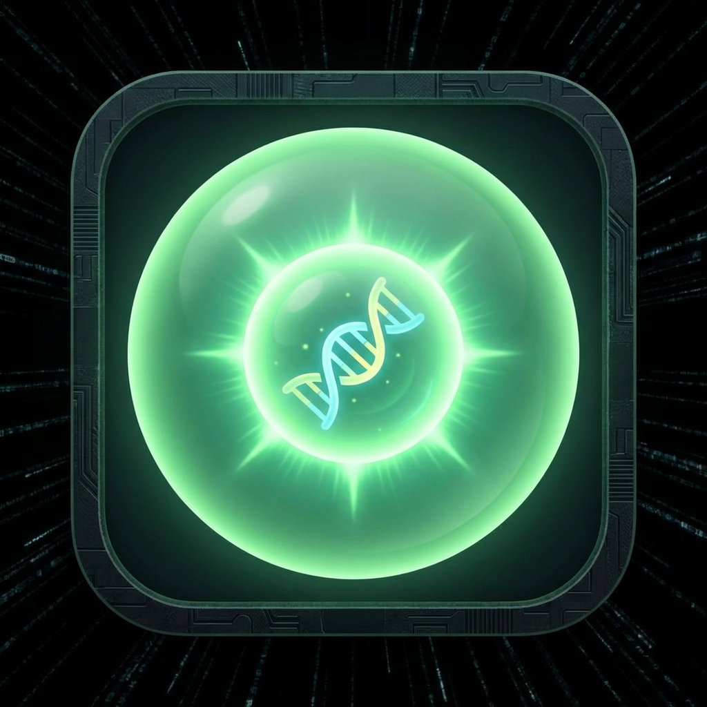

# CELLULAR WARS - Data Base

This document serves as the central repository for recording data and information regarding the **CELLULAR WARS** game project.

## �️ CORE PROJECT CONSTRAINTS (GHOST-MATRIX PROTOCOL)
*These rules are anchored to prevent regression. Do NOT modify without explicit User approval.*

1.  **Terminology**: Always refer to organisms as **Cells** (Official term). Avoid "Monsters" or "Oddies" in UI/Logs.
2.  **Fixed Formations**: Swapping positions during battle is **Disabled**. Cells remain in their Loadout positions.
3.  **Vanguard Shielding**: Wings are **Untargetable** unless the Vanguard is in **Necrosis** (except for Sniper/Hydro Shot-style bypass abilities).
4.  **Visual DNA**:
    *   **Necrosis**: Always uses **#444** (Very dark gray, 25% brightness) to represent shutdown.
    *   **Death FX**: Uses the "Heavy Drop" animation for containers with a bounce impact.
    *   **Layout**: Battlefield must be vertically centered to match background circles (CSS `top: 10px`).
5.  **Mechanic Purge**: No **LOCK** (Biochemical constraint) mechanic exists. Terminology is strictly **ACTIVE**, **VULNERABLE**, and **NECROSIS**.

## �📌 QUICK START SUMMARY (TÓM TẮT LUẬT CHƠI)
- **Mục tiêu**: Tiêu diệt toàn bộ 3 quái vật của đối thủ.
- **Đội hình**: Xếp hình tam giác (**1 Vanguard** - 2 Wings). Vanguard phải bị tiêu diệt trước (trừ đòn xuyên thấu).
- **Lượt chơi**:
    1. **Reinforce Phase**: Nhận 2 Pellicle, chia cho quái vật
    2. **Action Phase**: Kích hoạt **Pellicle Trail** (1 action per turn).
    3. **Combat Phase**: Chọn 1 quái vật để tấn công (1 attack per turn).
- **Cơ chế Overload**: Nếu con nào nhận hạt Pellicle thứ 6 -> **TỰ NỔ**, gây sát thương lan cho đồng đội bên cạnh.

## 🧬 CELLULAR WARS: RULEBOOK

### 1. THIẾT LẬP (SETUP) - ĐỘI HÌNH TAM GIÁC
*   **Đội hình**: 3 Monster xếp thành hình Tam Giác (1 Vanguard - 2 Wings).
    *   **Vanguard (Mũi nhọn)**: Đứng đầu. Chịu đòn trực tiếp. Đối thủ BẮT BUỘC tấn công vị trí này trước.
    *   **Wings (Cánh)**: Đứng sau hỗ trợ và tích lũy. Được Vanguard che chắn.
*   **Sinh mệnh (Pellicle)**: Mỗi Monster bắt đầu với **1 Pellicle** mặc định.
*   **Quy tắc 1-Hit**: Không có thanh HP. 0 Pellicle + Bị đánh = **NECROSIS**.

### 2. QUY TẮC PELLICLE (HỆ THỐNG MÀNG)
*   **Nạp (Reinforce)**: Đầu lượt nhận **2 Pellicle** để chia cho các Oddie (Tối đa 2 điểm/lượt).
    *   **Last Man Standing**: Nếu chỉ còn **duy nhất 1** quái vật còn sống, lượng Pellicle nhận được mỗi lượt tăng lên thành **3**.
*   **Ngưỡng quá tải (Overload)**: Max **5 Pellicle/Monster**. Nếu nhận điểm thứ 6 -> **TỰ NỔ (Explode)**.
    *   **Phản ứng dây chuyền (Chain Reaction)**: Khi một Monster nổ do Overload, nó gây **1 Sát thương (Thổi bay 1 Pellicle)** lên tất cả đồng đội đứng cạnh (Vanguard nổ -> Wings dính đạn và ngược lại).
*   **Chặn đòn**: Tiêu tốn **1 Pellicle** để triệt tiêu hoàn toàn 1 đòn tấn công từ đối thủ.

### Thuật Ngữ (Glossary)
*   **Cell**: Tên gọi chính thức cho các sinh vật/quái vật trong game.
*   **Pellicle (P)**: Đơn vị năng lượng kiêm lá chắn của Cell.
*   **Vulnerable**: Khi Cell không còn Pellicle, nó rơi vào trạng thái Nguy kịch (Vulnerable). Chỉ cần trúng thêm 1 đòn, Cell sẽ rơi vào trạng thái Necrosis.
*   **Necrosis**: Trạng thái "chết" của một Cell. Đừng lo, sau khi nghỉ ngơi trong Container, chúng sẽ phục hồi.
*   **Overload**: Nhận quá nhiều Pellicle sẽ khiến Cell bị nổ. Một số Cell có khả năng chứa Pellicle cao hơn bình thường.
*   **Vanguard**: Vị trí tiền đạo (đứng đầu).
*   **Wings**: Vị trí cánh (đứng sau).
*   **Reinforce Phase**: Giai đoạn nạp năng lượng.
*   **Action Phase**: Giai đoạn kích hoạt Pellicle Trail.
*   **Combat Phase**: Giai đoạn hành động/tấn công.

### 3. CẤU TRÚC LƯỢT CHƠI (PHASES)
1.  **Giai đoạn Nạp (Reinforce)**: Nhận 2 Pellicle và phân bổ vào các Monster.

2.  **Giai đoạn Hành động (Action)**: Kích hoạt các chuyên biệt **Offensive Trail** hoặc **Pellicle Trail**.
3.  **Giai đoạn Giao tranh (Combat Phase)**: Chọn **duy nhất 1** Monster để tấn công.

### 4. CƠ CHẾ CHIẾN ĐẤU & DI CHUYỂN
*   **Pellicle Burn**: Mọi đòn tấn công đều tốn Pellicle. Không có đòn đánh miễn phí.

### 5. QUY TẮC THÍCH NGHI LƯỢT ĐẦU (Acclimatization)
*   **Lượt 1 (Người đi trước)**: Chỉ được Nạp (Reinforce). Khóa cả Pellicle Trail và Offensive Trail.
*   **Lượt 1 (Người đi sau)**: Được phép dùng Pellicle Trail (tự vệ) nhưng vẫn khóa Offensive Trail.
*   **Từ lượt 2 trở đi**: Mở khóa hoàn toàn.

### 6. QUY TẮC KHU VỰC DỰ BỊ (DEPRECATED)
*   **Lưu ý**: Hệ thống dự bị hiện không áp dụng trong bản Ghost-Matrix. Đội hình là cố định.

### 7. CHIẾN THUẬT CỐT LÕI
*   **Quản lý rủi ro**: Tấn công càng mạnh thì tự vệ càng yếu (vì đốt sạch Pellicle).
*   **Ép Overload**: Sử dụng thẻ bài hoặc kỹ năng để bơm "thừa" Pellicle cho đối thủ, khiến chúng tự nổ.
*   **Lọc máu**: Hy sinh Nitrophil để bào mòn đội hình địch bằng phản sát thương, dồn tài nguyên cho Canobolus dứt điểm.
*   **Điều kiện thắng**: Loại bỏ toàn bộ 3 Monster của đối phương.

---

## 🦠 CELLDEX DATA
 
 ### Bảng Chỉ Số Chủng Loài (Cellular Trails)
 
| ID | Monster | Offensive Trail (Chủ động - Tốn P) | Pellicle Trail (Nội tại/Hỗ trợ) |
| :--- | :--- | :--- | :--- |
| **Cell00** | **Stemmy** | **Basic Strike (1P)**: Phá 1 màng đối thủ. | **None**: Không có hiệu ứng nội tại. |
| **Cell01** | **Cambihil** | **Overgrowth (1P)**: Phá 1 màng mục tiêu. | **Energy Burst (Action Phase)**: Hồi ngay 2 Pellicle (1 lần/trận). |
| **Cell02** | **Lydrosome** | **Hydro Shot (2P)**: Phá 1 màng. Chiến thuật bắn tỉa ưu việt, có thể bắn xuyên Vanguard. | **Osmotic Flow (Action Phase)**: Chuyển 1 Pellicle sang cho đồng đội. |
| **Cell03** | **Nitrophil** | **Nitro Burn (1P)**: Đốt 1 Pellicle của bản thân để phá 1 màng đối thủ. | **Reactive Membrane**: Phản lại 1 sát thương lên kẻ vừa tấn công. |
| **Cell04** | **Phagoburst** | **Triple Pop (2P)**: Bắn liên tiếp 3 shot (Phá 3 màng). | **Heavy Primer**: Lượt 1 không nạp P. Các lượt sau max 1P/lượt. |
| **Cell05** | **Fibron** | **Fiber Sting (1P)**: Phá 1 màng mục tiêu. | **Reinforce Presence**: Bắt đầu trận đấu với +1 Pellicle. |
| **Cell06** | **Kerashell** | **Light Strike (1P)**: Phá 1 màng mục tiêu (Thực dụng, rẻ). | **Vanguard**: Bắt đầu ván đấu với 2 Pellicle (khi ở vị trí Vanguard). |
| **Cell07** | **Mitonegy** | **Auto-Repair (2P)**: Phá 1 màng đối thủ + Hồi 1 màng cho đồng đội ít P nhất. | **Free Gift**: Vào trận, tặng ngay mỗi đồng đội +1P. |
| **Cell08** | **Chlarob** | **Quick Rob (2P)**: Phá 1 màng + Cướp 1P của đối thủ về cho mình. | **Loot Drop**: Khi bị hạ, +1P cho đồng đội có số P ít nhất. |
| **Cell09** | **Dip-Alpha** | **Twin Sting (1P)**: Phá 1 màng mục tiêu. | **Legacy Crash**: Khi OUT, -1P của enemy Vanguard. |
| **Cell10** | **Dip-Beta** | **Twin Sting (1P)**: Phá 1 màng mục tiêu. | **Energy Leak**: Khi OUT, -1P của đứa cao P ở vị trí Wings. |
| **Cell11** | **Canobolus** | **Ballistic Volley (XP)**: Đốt sạch X màng đang có để bắn ra X phát đạn. Mỗi phát phá 1 màng. | **Root Synergy**: Ngưỡng Overload là 7. |
 
 ### Thông Tin Chi Tiết (Lore & Mechanics)
 
| ID | Monster | Hình ảnh | Phân loại | Mô tả Lore (Lịch sử & Đặc tính) |
| :--- | :--- | :--- | :--- | :--- |
| **Cell00** | **Stemmy** |  | Basic / Origin | **Tế bào gốc - Stem Cell**: Loại tế bào sơ khai nhất, có khả năng biến đổi thành mọi loại tế bào khác nhưng bản thân nó lại cực kỳ đơn giản. |
| **Cell01** | **Cambihil** |  | Supporter / Tank | **Tầng phát sinh - Cambium**: Tế bào thực vật chuyên biệt với khả năng phân chia nhanh; nó có thể tái tạo tức thì một lượng lớn năng lượng (2P) để xoay chuyển cục diện. |
| **Cell02** | **Lydrosome** |  | Tactician / Medic | **Tiêu thể - Lysosome**: Túi chứa Enzyme phân hủy bị nhiễm men; nó bắn ra các luồng dịch hóa học phá quấy màng tế bào của đối phương và có thể chuyển hóa lớp màng bảo vệ cho đồng đội. |
| **Cell03** | **Nitrophil** |  | Guardian / Bouncer | **Bạch cầu trung tính**: Tế bào miễn dịch đột biến mang đặc tính nổ; nó tiêu diệt kẻ địch bằng đòn đánh tự tiêu vớt và phản đòn lập tức khi lớp màng bị xâm phạm. |
| **Cell04** | **Phagoburst** |  | Burst Damager | **Tế bào thực bào - Phagocyte**: Kẻ dọn dẹp khổng lồ với cấu trúc đa nhân phức tạp; nó hấp thụ năng lượng cực chậm nhưng có thể kích nổ một đợt 3 phát bắn hủy diệt mục tiêu. |
| **Cell05** | **Fibron** |  | Mobility Support | **Tế bào sợi - Fibroblast**: Tế bào tạo liên kết được gia cố vi mạch; nó sở hữu cấu trúc linh hoạt giúp tích lũy năng lượng sớm ngay khi bắt đầu trận đấu. |
| **Cell06** | **Kerashell** |  | Tanker | **Tế bào sừng - Keratinocyte**: Lớp vỏ từ Protein sừng của da được nén cứng; nó sở hữu sức bền tự thân cao và khả năng tấn công tiêu hao ít năng lượng nhất đội hình. |
| **Cell07** | **Mitonegy** |  | Support | **Ti thể - Mitochondria**: Bào quan tạo năng lượng bị lỗi mã nguồn; nó hoạt động như một máy biến áp, phân phát Pellicle đầu trận và tự động vá màng cho đồng đội yếu nhất. |
| **Cell08** | **Chlarob** |  | Scavenger | **Vi khuẩn Chlamydia**: Vi khuẩn ký sinh nội bào bắt buộc; nó thâm nhập sâu vào tế bào đối phương để cướp năng lượng và giải phóng tài nguyên cứu trợ khi bị tiêu diệt. |
| **Cell09** | **Dip-Alpha** |  | Dual Combatant | **Song cầu khuẩn - Diplococcus**: Biến thể "anh" của cặp vi khuẩn song sinh; gã phối hợp tấn công kép cùng em mình nhưng cái chết của gã sẽ rút cạn năng lượng của kẻ địch. |
| **Cell10** | **Dip-Beta** |  | Dual Combatant | **Song cầu khuẩn - Diplococcus**: Biến thể "em" của cặp vi khuẩn song sinh; cô cùng anh trai tạo ra gọng kìm tấn công liên tục, nhưng nếu bị OUT sẽ làm rò rỉ năng lượng của kẻ địch. |
| **Cell11** | **Canobolus** |  | Glass Cannon / Carry | **Bào tử bắn - Ballistospore**: Tế bào nấm mang cơ chế áp suất máy bắn đá; nó bám rễ để hấp thụ Pellicle cực nhanh vả xả ra những đợt đạn bào tử liên tiếp như pháo cao xạ. |
 
 ### 8. LỊCH SỬ BẢO TRÌ & FIX BUG (MAINTENANCE LOG)
*   **[UPDATE] Đội hình cố định (Fixed Formation)**: Loại bỏ cơ chế đổi vị trí (Swap) trong trận đấu. Monsters giữ nguyên vị trí từ Loadout Menu.
*   **[FIX] Hình ảnh Cell Container**: Khắc phục lỗi mất hình ảnh quái vật khi bị tiêu diệt (OUT) trong trận đấu. Các vị trí quái vật bị hạ hiện được thay thế bằng biểu tượng **CellContainer** xám (Grayscale).
*   **[POLISH] Status Terminology & Colors**: Chuyển đổi thuật ngữ trạng thái hệ thống: "OUT/System Waste" -> **NECROSIS** (Màu Xám). Chuẩn hóa màu sắc: **Active** (Xanh lá), **Vulnerable** (Đỏ).
*   **[FIX] Info Panel Expansion**: Cập nhật Panel thông tin hiển thị chính xác cho các P-Token và các đơn vị đã bị tiêu diệt (System Waste).
*   **[REVERT] Visual Fidelity**: Khôi phục hệ thống vòng Pellicle (Rings) và hiệu ứng Vulnerable (0 P) theo đúng thiết kế gốc.
*   **[CLEANUP] Loadout UI**: Tinh chỉnh giao diện Loadout Menu, loại bỏ hoàn toàn các chỉ báo trạng thái trận đấu (như OUT/Gray-out) để giữ giao diện quản lý đội hình tập trung và sạch sẽ. Hình ảnh quái vật hiện hiển thị đầy đủ màu sắc kể cả khi đã bị hạ trong trận đấu trước đó.
*   **[POLISH] UI Aesthetics**: Triển khai hình nền riêng biệt cho Main Menu (`BG_Main.png`), Battlefield (`BG_Battle.png`) và Cell Container screen (`BG_CellContainerMenu.png`) kèm lớp phủ tối (Dark Overlay) để tăng độ tương phản.
*   **[POLISH] Layout Optimization**: Tinh chỉnh vị trí tiêu đề và các nút chức năng tại Main Menu để tối ưu không gian hiển thị cho Artwork mới.
*   **[POLISH] Darker Necrosis**: Giảm độ sáng của thuật ngữ **NECROSIS** xuống mức 25% (Màu #444) tạo hiệu ứng "mất năng lượng" rõ rệt.
*   **[FIX] AI Tactical Upgrade**: Khắc phục lỗi AI tấn công vào các vị trí đã bị tiêu diệt (NECROSIS). AI hiện đã nhận diện và bỏ qua các đơn vị không còn khả năng chiến đấu.
*   **[UPDATE] Lydrosome Refinement**: Loại bỏ hoàn toàn cơ chế **LOCK** để đơn giản hóa và cân bằng lối chơi Sniper.
*   **[CLEANUP] Codebase Audit**: Dọn dẹp toàn bộ thuộc tính dư thừa (`isLocked`, `hasSwapped`), tối ưu hóa logic Drag & Drop và sửa lỗi cú pháp trong vòng lặp pellicle.
*   **[NEW] AI Simulation Profiles**: Triển khai hệ thống AI Loadout Pool với 3 cấp độ khó (Easy, Medium, Hard). AI hiện sẽ chọn ngẫu nhiên đội hình từ danh sách Preset mỗi khi bắt đầu trận đấu.
*   **[NEW] Cell00 - Stemmy**: Tích hợp chủng loài mới "Stemmy" (Stem Cell) - thực thể sơ khai đóng vai trò là chủng loài nền tảng cho các đội hình cấp thấp.
*   **[NEW] Settings Menu**: Thêm menu Cài đặt mới cho phép người chơi thay đổi độ khó và xem trước danh mục các hồ sơ đe dọa (Threat Profiles) của AI.
